# CineBook - Online Movie Ticket Booking System

CineBook is a full-stack cinema booking web application built as a CMPG 311 group project at North-West University.

This repository represents combined team work by the project group. It is presented in my portfolio to show my involvement in project coordination, integration support, database/backend support, documentation, and collaborative software development.

## Project Context

This was an academic group project completed for CMPG 311. The goal was to design and implement a database-backed booking system while applying software engineering, database design, and full-stack development concepts.

The system allows users to browse movies, view show schedules, select seats, make bookings, and complete a simulated payment flow. It also includes role-based dashboards for customers, cinema managers, and administrators.

## Team Project Note

CineBook was completed as a CMPG 311 group project at North-West University. This repository represents combined team work, with different members contributing to the database design, backend routes, frontend pages, UI components, authentication, booking flow, documentation, and integration.

I include this project in my portfolio as evidence of collaborative software engineering experience, database-backed application development, and exposure to full-stack project integration.

The `.github/CODEOWNERS` file was used as a project review and ownership guard during integration. It should not be read as individual authorship of the entire system.

## My Contribution

This was an 8-person team project. Within the team, my specific areas were:

- **Database schema and analytical queries** — the Oracle `schema.sql` and `queries.sql` used for the academic database submission.
- **Backend routes** — the payment and booking routes in `backend/routes/payments.js` and `backend/routes/bookings.js`.
- **Frontend components** — `MovieHero.jsx` and the `AuthContext.jsx` authentication context.
- **Project coordination and integration** — repository structure, branching strategy, pull request workflow, and integration support across the team.

The `.github/CODEOWNERS` ownership map assigned these files to me for review, and documented the broader division of work across the group:

- **Thato** — Oracle indexes/views, movie/show/seat backend routes.
- **Ncobile** — Oracle seed data and MySQL seed data.
- **Dineo** — Home and movie pages, movie card component.
- **Clifford** — Booking and payment pages, booking summary component.
- **Banele** — Extra Oracle SQL, seat grid and confirmation components, navbar.
- **Tshepo** — Auth routes, token verification middleware, login/register/profile pages.

The system as a whole was built collaboratively by all team members; this section records the areas I personally worked on and credits my teammates for theirs.

## Features

- Movie browsing and movie detail pages.
- Show schedule viewing.
- Seat selection for bookings.
- Customer booking flow.
- Simulated payment flow with ticket confirmation handling.
- JWT-based authentication.
- Role-based access for customers, cinema managers, administrators, and system administrators.
- Admin dashboard for users, movies, shows, bookings, and revenue.
- Manager dashboard for theatre-scoped shows, bookings, occupancy, and revenue.
- MySQL database files for the React/Node web app.
- Oracle SQL files for the academic database phase.

## Architecture

```text
CineBook/
├── backend/        Express.js API, authentication, routes, email service
├── frontend/       React + Vite user interface
├── database/
│   ├── mysql/      MySQL schema and seed data for the web app
│   └── oracle/     Oracle SQL Developer submission files
└── .github/        Team ownership and pull request templates
```

## Technologies Used

| Layer | Technologies |
|---|---|
| Frontend | React, Vite, Tailwind CSS, React Router, Axios |
| Backend | Node.js, Express.js |
| Database | MySQL, Oracle SQL |
| Authentication | JWT, bcrypt |
| Email / Notifications | Nodemailer, SMTP configuration |
| Security / Middleware | Helmet, CORS, Express rate limiting |
| Tools | npm, Git, GitHub |

## Database Design

The database models the main relationships needed for a cinema booking system:

- `Users` stores customers, managers, administrators, and system administrators.
- `Movie` stores movie information.
- `Theatre`, `Screen`, and `Seat` model the cinema layout.
- `ShowSchedule` links movies to screens and show times.
- `Booking` stores customer bookings.
- `BookingSeat` connects bookings to selected seats.
- `Payment` stores payment information linked to bookings.

The project includes both MySQL files for the web app and Oracle files for the academic database submission.

## Setup Instructions

### Prerequisites

- Node.js 18+
- npm 9+
- MySQL 8+

### Database Setup

```bash
mysql -u root -p < database/mysql/schema.sql
mysql -u root -p cinebook_db < database/mysql/seed.sql
```

### Backend Setup

```bash
cd backend
npm install
copy env.example .env
npm run dev
```

Backend URL:

```text
http://localhost:5000
```

### Frontend Setup

```bash
cd frontend
npm install
npm run dev
```

Frontend URL:

```text
http://localhost:5173
```

## Test Accounts

The seed data includes local development accounts for testing.

| Role | Email | Password |
|---|---|---|
| Administrator | admin@cinebook.co.za | Admin123 |
| Cinema Manager | manager.sandton@cinebook.co.za | Test123 |
| Customer | customer@test.co.za | Test123 |

These are sample local development credentials, not production credentials.

## Screenshots

| Screen | Preview |
|---|---|
| Home page | 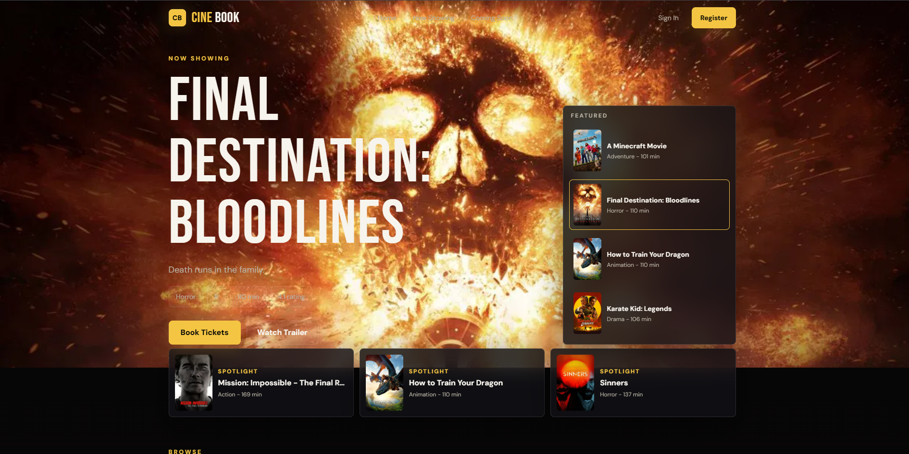 |
| Now showing | 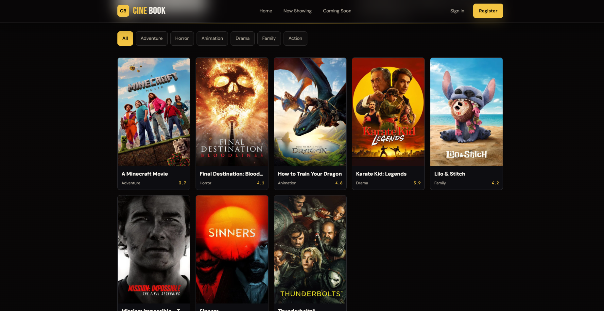 |
| Coming soon | 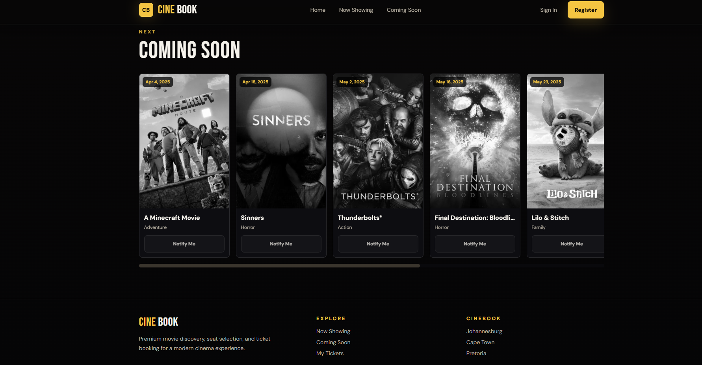 |
| Sign in | 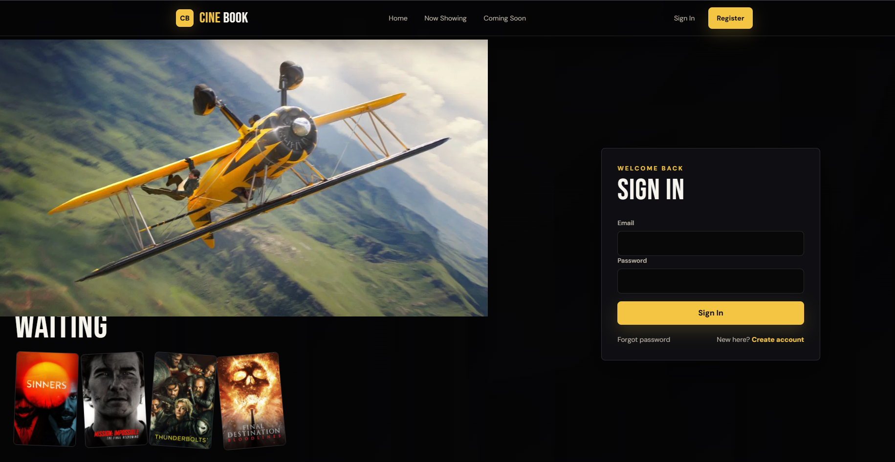 |
| Create account | 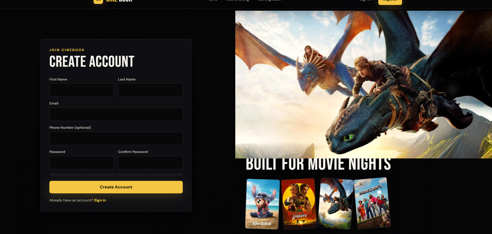 |
| Admin operations dashboard | 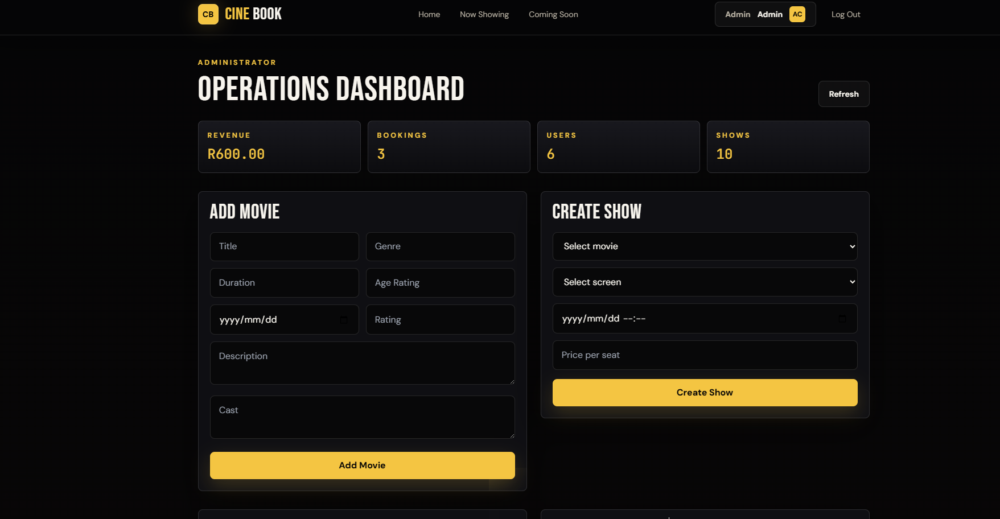 |
| Movie details & booking | 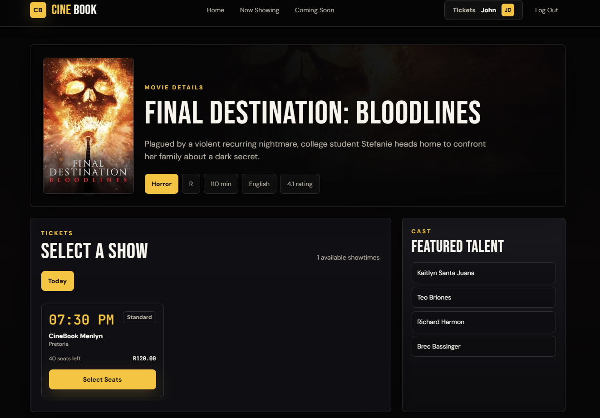 |
| Seat selection & checkout | 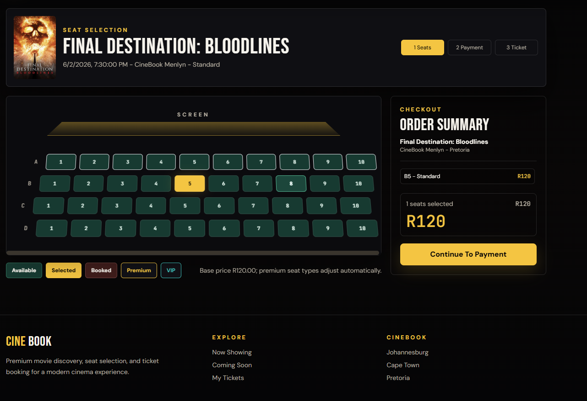 |
| Payment & confirm order | 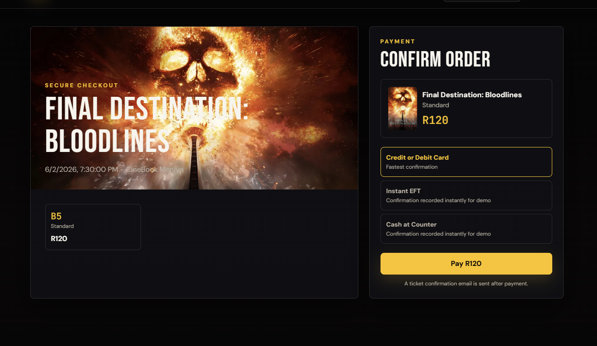 |
| Ticket confirmation email | 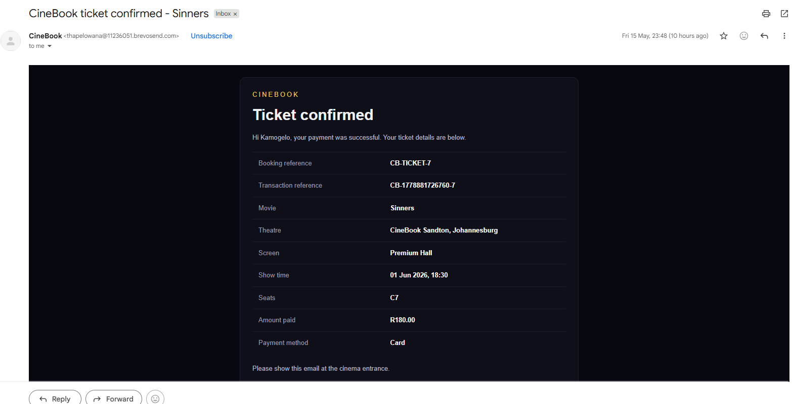 |
| Member profile & bookings | 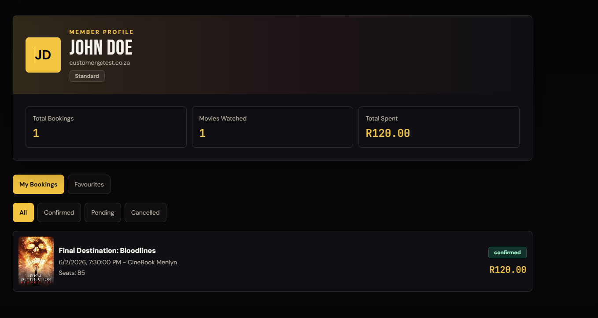 |
| Cinema manager dashboard | 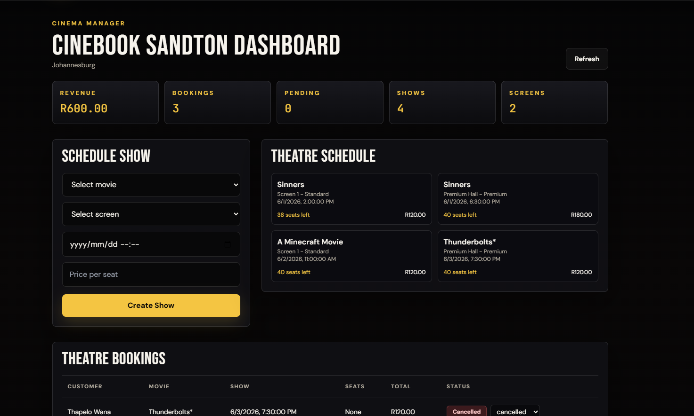 |
| Theatre bookings table | 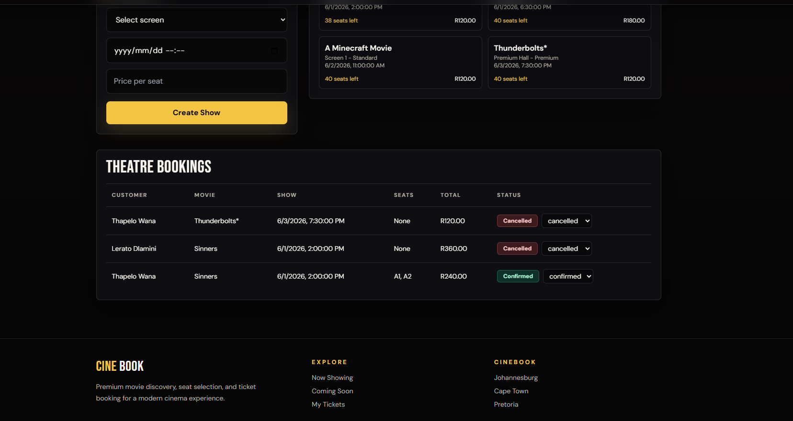 |

## What I Learned

- How frontend, backend, and database layers work together in a full-stack system.
- How role-based access changes application flow and dashboard behaviour.
- How database design supports booking, seat, schedule, and payment workflows.
- How important communication, file ownership, and integration planning are in group projects.
- How to document a group project clearly for future review.

## Challenges

- Coordinating work across multiple team members.
- Keeping database files aligned between Oracle academic submission files and MySQL web app files.
- Managing authentication, roles, and protected routes.
- Integrating booking, payment, and email confirmation logic.
- Preserving team contributions while cleaning the repository for portfolio presentation.

## Future Improvements

- Add screenshots and a short demo walkthrough.
- Review duplicate frontend files before removing anything.
- Clarify which database files are active and which are academic/reference files.
- Add stronger validation and error handling.
- Add automated tests for core API routes.
- Improve mobile responsiveness and UI polish.
- Add a deployment guide if the project is hosted.

## Repository Cleanup Note

This repository is currently being polished for portfolio presentation while preserving the original group-project work. Some duplicate frontend files and overlapping database scripts are being reviewed before removal to avoid deleting any team work that may still be referenced.

## Academic Note

This project was built for learning purposes as part of a university group project. It is presented as a student software engineering and database systems project, not as a commercial production system.
